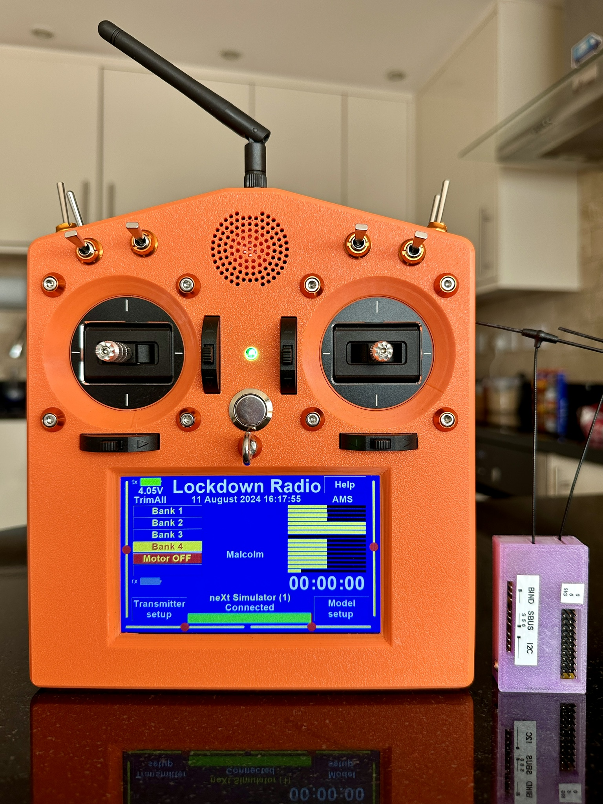

# Lockdown Radio Control

## Why would anyone choose to use LockDownRadioControl (LDRC) instead of EdgeTX or a commercial system? Here are a few reasons:

**LockDownRadioControl (LDRC)** is an open-source radio system designed for simplicity, speed, and reliability. It’s ideal for users who want a system that “just works” — no tinkering, no steep learning curve, and no unnecessary options. Whether you’re an experienced pilot or just starting out, LDRC offers a streamlined alternative to EdgeTX and commercial transmitters.

---

### (0) Simplicity

LDRC isn’t trying to be compatible with every protocol under the sun. It avoids bloat by skipping rarely-used features and focusing on what’s needed to fly — cleanly and reliably. As a result, it’s easy to understand and quick to use.  
(Of course, it does support SBUS and PWM — for flight controllers and servos.)

---

### (1) Automatic Model Selection (AMS)

LDRC doesn’t just warn you if you’re trying to connect to the wrong model — it _automatically loads the correct one_. You don’t need to go hunting through menus every time you change aircraft.

---

### (2) Onboard Model Memory Backups

Backups are stored directly in the transmitter. You can quickly create or restore a backup, making it easy to experiment with changes — and undo them if needed.

---

### (3) Wireless Model Memory Exchange

Model memories can be copied between transmitters over the RF link — no wires, no SD card juggling, no PC software. The model ID is included automatically, so AMS continues to work correctly on the new transmitter.  
This is especially useful in wireless buddy box sessions, ensuring Master and Buddy share the same setup.

---

### (4) Wireless Buddy Boxing — No Extra Hardware

LDRC supports seamless wireless buddy boxing _with no extra modules or dongles_. Control handover is instantaneous, thanks to the fast microcontroller processing over 800 data packets per second.  
When the master needs to take over to save the model, there’s no hesitation — and that can prevent a crash.

---

### (5) Data screen

This screen reveals current and average data packet rate, total lost packets counter, maximum and average reconnection times after lost packet, transceiver swaps count, and lots of other critical information that other systems hide.

---

## Introduction (Please scroll down for BOM. Assembly instruction coming here later!)

This is a very full featured 16 channel Radio Control system for models of all kinds. I've been developing this project since Lockdown in May 2020.

I and several friends have flown many models with it for about 5 years so far, without any problem.

It's proven to be as good as, and in some respects better than, popular commercially available radio control systems, as well as the other open source radio control firmware.

It is also **far cheaper**. Though I doubt that a really equivalent commercial system even exists.

I estimate the cost to be only around £120 per transmitter, and around £35 per receiver depending on where you buy the components.

The microcontrollers are **Teensy 4.1** in the transmitter and **Teensy 4.0** in the receiver. These use the ARM Cortex M7 (at 600 MHz) which is probably the fastest MCU used in any radio control system.

The transceivers are Ebyte's **ML01DP5** for the transmitter, and two **ML01SP4**s for the receiver.

The screen is a **Nextion NX8048P050 5" Capacitive touch screen**.

The sticks used are **FrSky M9 Hall Sensor Gimbal.**

The digitial trims are also FrSky (X9D Plus transmitter parts Trim switch).

The cases for the transmitter and receiver are 3D printed in whatever plastic you prefer. I prefer PETG.

This repository contains not only the code for the transmitter, its screen and the receiver; but also the Gerber files for the printed circuit boards, the .STL files for the cases etc. and the text files for the help screens (to go onto the SD card.). So there's nothing to stop anyone from buiding one.

If you would like to make one, I'll be happy to help you. [Email me (Malcolm Messiter mmessiter@gmail.com).](mailto:mmessiter@gmail.com)

I just added the BOM to this file (scroll down...)

Recently I have removed all PPM functions because no one uses them any more. This has freed up some memory and some GPIO pins on the MCU. These can now be used in future developments.

I have just added 'nudge mode' the the wireless buddy feature and a variometer for gliders so the transmitter can now emit an audible signal to indicate when the model is ascending or decending, to help with finding thermals.

Right now I am adding PID stabilisation. It's currently still under developement and I'll add a note here when it's done, tested, and ready to fly!

## Features

New features are added from time to time, especially when requested by users and other club flyers.

Here is a brief summary of the features supported at the time of writing (July 2025): -

- 16 Channels.
- 4 flight modes, each with its own curve for output.
- 32 mixes (for inputs or outputs).
- 90 model memories; with almost unlimited backup file space.
- 11 PWM servo outputs, all with definable centre points and frequencies.
- 'Dual rates' (... except there are actually _three_ rates.)
- Model memory backup and restore using internal SD card.
- 500 Hz frame rate (400 Hz when wireless buddying)
- 100 Hz FHSS using 82 separate frequencies on the 2.4 GHz ISM waveband.
- 12 BIT servo resolution.
- Very small data packet size, to reduce FHSS frequency collisions.
- Wireless Buddy Box, now with 'nudge' mode', for training beginners.
- "AMS" (**A**utomatic **M**odel **S**election) loads correct model memory automatically on connection to model.
- **Buddy** transmitter also automatically loads the same model memory as **Master** has loaded.
- Wireless model memory sharing. This allows copying model memories to another transmitter **without** removing any SD cards.
- Telemetry including model's battery volts and GPS location, speed, altitude, heading, distance from home, etc.
- Speaker gives critical voice messages and other audio prompts.
- User defined Channel names, and inputs and outputs,
- 5 point curves for each channel and all four flight modes. Supports straight, smoothed, and expo.
- Failsafe.
- 8 user definable switches. (and four of these can be knobs for continious variation of a channel).
- Digital trims, subtrim, servo reverse, servo speeds, user macros, motor timer, log files, etc., etc...
- Receiver supports SBUS and PWM (with definable frequency and centre position).
- Variometer function for gliders.
- Context sensitive help screens for all functions.

# Bill of Materials (BOM)

**Project:** LockDownRadioControl

---

## Receiver

| **Category**       | **Item**                 | **Details / Notes**              | **Qty** |
| ------------------ | ------------------------ | -------------------------------- | ------- |
| Structural         | PETG filament or similar | For the case                     | -       |
| Structural         | IPEX dipole antenna      | 2.4 GHz                          | 2       |
| Connectors         | Male headers             | Various                          | Several |
| Connectors         | 3-row male headers       | -                                | Some    |
| Materials          | Solder                   | -                                | Some    |
| PCB & Modules      | Printed circuit board    | Use Gerber file                  | 1       |
| PCB & Modules      | Teensy 4.0               | Main microcontroller             | 1       |
| PCB & Modules      | EByte ML01SP4            | RF module                        | 2       |
| Power & Regulation | AMS 1117 3.3V regulator  | Linear regulator                 | 1       |
| Power & Regulation | Pololu S9V11F5 regulator | Better than 7805, pin-compatible | 1       |
| Passive Components | Tantalum Capacitor       | 47 µF, 1206 SMD                  | 2       |
| Passive Components | Ceramic Capacitor        | 100 nF, 1206 SMD                 | 2       |
| Passive Components | LED                      | 1206 SMD, any colour             | 1       |
| Passive Components | Resistor                 | 100 Ω, 1206 SMD for LED          | 1       |
| Passive Components | Tantalum Capacitor       | 330 µF, 0E907, SMD               | 1       |

---

## Transmitter

| **Category**       | **Item**                      | **Details / Notes**                   | **Qty** |
| ------------------ | ----------------------------- | ------------------------------------- | ------- |
| Structural         | PETG filament or similar      | For the case                          | -       |
| Structural         | RGB LED                       | 5 mm, common anode                    | 1       |
| Structural         | Push Button Switch            | 16mm vandal-resistant, momentary SPST | 1       |
| Structural         | FrSky Trim switches           | From X9D Plus transmitter             | 4       |
| Structural         | FrSky M9 Gimbal               | Hall sensor                           | 2       |
| Structural         | Antenna                       | RP-SMA 2.4 GHz                        | 1       |
| Structural         | Extension Cable               | RP-SMA male to female, 20 cm          | 1       |
| Structural         | Self-tapping screws           | 3 mm x 2 mm flange and various sizes  | Several |
| Structural         | M3 bolts with locknuts        | -                                     | Some    |
| Structural         | Cable ties                    | 2 mm wide                             | Some    |
| Structural         | Epoxy adhesive                | 5 minute                              | -       |
| Structural         | Solder                        | -                                     | Some    |
| PCB & Modules      | Printed circuit board         | Use Gerber file                       | 1       |
| PCB & Modules      | Teensy 4.1                    | Main microcontroller                  | 1       |
| PCB & Modules      | Nextion Display               | NX8048P050, 5" capacitive touch       | 1       |
| PCB & Modules      | ML01DP5                       | RF module                             | 1       |
| PCB & Modules      | POLOLU-2808 Electronic switch | -                                     | 1       |
| PCB & Modules      | microSD card                  | Up to 2 TB, exFAT formatted           | 1       |
| PCB & Modules      | RTC module                    | I2C, DS1307                           | 1       |
| Power & Regulation | Voltage Regulator             | Pololu 5V 1A S13V10F5 or 7805         | 2       |
| Power & Regulation | AMS 1117 3.3V regulator       | -                                     | 1       |
| Power & Regulation | Micro USB Charger             | 2S balanced                           | 1       |
| Power & Regulation | LiPo Battery                  | 2S, suitable size                     | 1       |
| Power & Regulation | Diodes                        | IN5406                                | 2       |
| Power & Regulation | Diodes                        | IN4001                                | 2       |
| Passive Components | Electrolytic Capacitor        | 330 µF                                | 1       |
| Passive Components | Electrolytic Capacitor        | 100 µF                                | 1       |
| Passive Components | Tantalum Capacitor            | 330 µF, 0E907, SMD                    | 2       |
| Passive Components | Ceramic Capacitor             | 330 nF, 1206 SMD                      | 2       |
| Passive Components | Tantalum Capacitor            | 47 µF, 1206 SMD                       | 2       |
| Passive Components | Ceramic Capacitor             | 100 nF, 1206 SMD                      | 4       |
| Passive Components | Ceramic Capacitor             | 10 µF, 1206 SMD                       | 1       |
| Connectors         | Male headers                  | Various                               | Several |
| Connectors         | Female headers                | Various                               | Several |
| Connectors         | 3-row male headers            | -                                     | Some    |
| Connectors         | 2x4 socket header             | Female                                | 1       |
| Connectors         | Servo cable                   | Three-core                            | Some    |
| Connectors         | DuPont connectors             | 3- and 4-pin female                   | Several |
| Controls           | RC switches                   | Three-position                        | 8       |
| Controls           | Rheostat knobs                | Optional (can replace 4 RC switches)  | Up to 4 |
