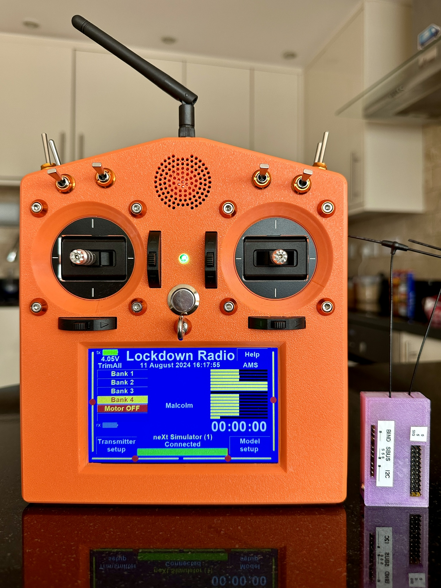

# Lockdown Radio Control

## Introduction

This is a very full featured 16 channel Radio Control system for models of all kinds. I've been developing this project since Lockdown in May 2020. 

I and several friends have flown many models with it for about 4 years so far, without *even one* problem. 

It's proven to be at least as good as, and in many respects better than, popular commercially available radio control systems, and indeed other open source radios.

It is also **far cheaper**. Though I doubt that a really equivalent commercial system even exists. 

I estimate the cost to be only around £120 per transmitter, and around £35 per receiver depending on where you buy the components. 

The microcontrollers are **ARM Cortex M7 (at 600 MHz)**. These are on the Teensy 4.1 and 4.0 boards. Extremely fast.

The recommended transceivers are Ebyte's **ML01DP5** for the transmitter, and two **ML01SP4**s for the receiver.

The screen is a **Nextion NX8048P050 5" Capacitive touch screen**.

The cases for the transmitter and recevier are 3D printed in whatever plastic you prefer. I prefer PETG.

This repository contains not only the code for the transmitter, its screen and the receiver; but also the Gerble files for the printed circuit boards, the .STL files for the cases etc. and the text files for the help screens (to go onto the SD card.). So there's nothing to stop anyone from buiding one.

If you would like to make one, I'll be happy to help.  Just email me: Malcolm Messiter (**mmessiter@gmail.com**). 

Eventually I plan to put building instructions onto this repo. I would have already, but I have been busy writing the code.

## Features

New features are added from time to time, especially when requested by users and other club flyers. 

Here is a brief summary of the features supported at the time of writing (August 2024): -

* 16 Channels.
* Range of about 2 kilometres.
* Very easy to use touch screen graphic user interface.
* 4 flight modes (or banks).
* 32 mixes (mix inputs or outputs).
* 90 model memories.
* 11 PWM servo outputs.
* Model memory backup and restore using internal SD card.
* 50 Hz FHSS at using 82 separate frequencies on the 2.4 GHz ISM waveband.
* 200 Hz frame rate for very low latency.
* 12 BIT resolution.
* Wireless Buddy Box for training beginners.
* "AMS" (**A**utomatic **M**odel **S**election) loads correct model memory automatically on connection to model. 
* **Buddy** transmitter also automatically loads the same model memory as **Master** has loaded.
* Wireless model memory sharing. This allows copying model memories across to another transmitter without removing any SD cards.
* Telemetry including model volts (and GPS, temperature & barometric pressure, when using custom sensor hub)
* Speaker gives critical voice messages and other audio prompts.
* User defined Channel names.
* User mapped input and output channels.
* 5 point editable curves for every channel and every flight mode. Supports straight, smoothed, and expo.
* Failsafe.
* 4 user definable switches.
* Digital trims, rates, subtrim, servo reverse, servo speeds, macros, timer, log files, etc., etc.
* Support for SBUS, PWM (with definable frequency and centre position), and PPM.
* Support for third party transmitter models (JR type).
* Context sensitive help screens for all functions.

